### Hi there, I'm [Xnhyacinth](https://xnhyacinth.github.io/) 👋

  <!-- dynamic typing effect 动态打字效果 -->
  

    
  

  
<!-- knock code pictures 敲代码的图片 -->
  <picture>
    <source media="(prefers-color-scheme: dark)" srcset="https://cdn.jsdelivr.net/gh/sun0225SUN/sun0225SUN/assets/images/coding.gif" />
    <source media="(prefers-color-scheme: light)" srcset="https://cdn.jsdelivr.net/gh/sun0225SUN/sun0225SUN/assets/images/developer.svg" height="225px" />
    
  </picture>

<!--
**Xnhyacinth/Xnhyacinth** is a ✨ _special_ ✨ repository because its `README.md` (this file) appears on your GitHub profile.

Here are some ideas to get you started:

- 🔭 I’m currently working on ...
- 🌱 I’m currently learning ...
- 👯 I’m looking to collaborate on ...
- 🤔 I’m looking for help with ...
- 💬 Ask me about ...
- 📫 How to reach me: ...
- 😄 Pronouns: ...
- ⚡ Fun fact: ...
### Yoo, I'm Huanxuan Liao 👋

-->

- 🍻 M.Eng. Student at CASIA
- 🏃 like bulk / gym / basketball
- 📫 Contact me with liaohuanxuan2023@ia.ac.cn & huanxuanliao@gmail.com
- 😄 Personal Page: https://xnhyacinth.github.io

 
  
<h2>📊 Github Stats and Activity</h2>

  
  <h3>💻 GitHub Profile Stats</h3>

  <!-- https://github.com/anuraghazra/github-readme-stats -->

  
  
   

  <b>Note:</b> Top languages is only a metric of the languages my public code consists of and doesn't reflect experience or skill level.

  <!-- https://github.com/ashutosh00710/github-readme-activity-graph -->
  
  

  ### :zap: Recent Activity

  <!--START_SECTION:activity-->
1. 🗣 Commented on [#22](https://github.com/Xnhyacinth/Awesome-LLM-Long-Context-Modeling/issues/22#issuecomment-2846128181) in [Xnhyacinth/Awesome-LLM-Long-Context-Modeling](https://github.com/Xnhyacinth/Awesome-LLM-Long-Context-Modeling)
2. 🎉 Merged PR [#21](https://github.com/Xnhyacinth/Awesome-LLM-Long-Context-Modeling/pull/21) in [Xnhyacinth/Awesome-LLM-Long-Context-Modeling](https://github.com/Xnhyacinth/Awesome-LLM-Long-Context-Modeling)
3. 🗣 Commented on [#5](https://github.com/SalesforceAIResearch/ThinK/issues/5#issuecomment-2742204444) in [SalesforceAIResearch/ThinK](https://github.com/SalesforceAIResearch/ThinK)
4. 🔒 Closed issue [#5](https://github.com/SalesforceAIResearch/ThinK/issues/5) in [SalesforceAIResearch/ThinK](https://github.com/SalesforceAIResearch/ThinK)
5. 🗣 Commented on [#5](https://github.com/SalesforceAIResearch/ThinK/issues/5#issuecomment-2740774652) in [SalesforceAIResearch/ThinK](https://github.com/SalesforceAIResearch/ThinK)
  <!--END_SECTION:activity-->

  

  
&nbsp;

  <table>
    <tr>
      <td></td>
<!--       <td></td> -->
      <td></td>
    </tr>
    <tr>
      <td></td>
      <td></td>
    </tr>
    <tr>
      <td></td>
      <td></td>
    </tr>
    <tr>
      <td></td>
      <td></td>
    </tr>
  </table>
  
  
  

